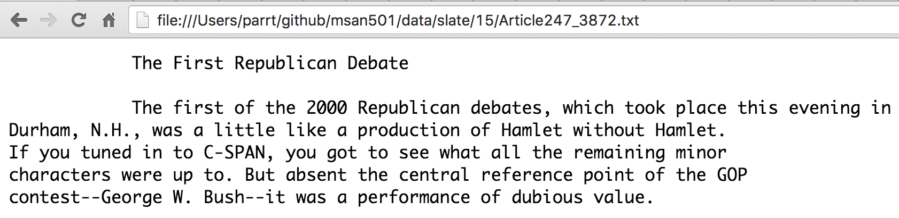

# Search-Engine-Implementation

## Objective
The goal of this project is to explore how hashtables work and compare the performance to linear search. Along the way, the application will display search results in a browser window and being able to navigate to documents.

A **search engine** accepts one or more **terms** and searches a corpus for files matching *all* of those terms.  A **corpus** is just a directory and possibly subdirectories full of text files. Here is a fragment of a sample search results page as displayed in Chrome (activated from Python); clicking on a link brings up the actual file.

| HTML output        | File Content |
| ---------- | -----
|  ||

## Data source
- [American National corpus](http://www.anc.org/data/oanc/contents/)
- [Slate](https://github.com/parrt/msds692/blob/master/data/slate.7z)
- [Berlitz travelogues](https://github.com/parrt/msds692/blob/master/data/berlitz1.7z)

## Installation
We will need the 7z compression utility to uncompress those data.

## Running command 
Assuming you have placed the slate directory under a data directory in your home directory.

```bash
$ python search.py linear ~/data/slate
$ python search.py index ~/data/slate
$ python search.py myhtable ~/data/slate
```

Here is what the program looks like in action:

```bash
$ python search.py linear ~/data/slate
4530 files
Search terms: Reagan Iran
```
After we enter the search terms and hit return, the Python program pops up the default browser on the HTML file we have just generated as a result of the search.